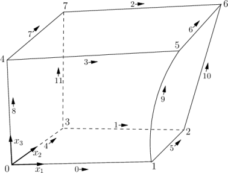
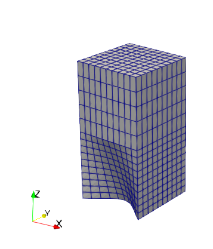

# nemoblock

[](https://github.com/psf/black)

## Project description

nemoblock provides utilities to generate blockMeshDicts for structured mesh generation in OpenFOAM. It manages the numbering of the points, the orientation of the surfaces and the connections between the blocks. In this way it helps the user to focus on the most important point: generating high quality meshes.

## Prerequisites

nemoblock requires Python >= 3.7. The following dependencies are installed automatically: matplotlib, numpy, scipy.

If you encounter any problems with these packages try:

```shell
pip install --upgrade matplotlib
pip install --upgrade numpy
pip install --upgrade scipy
```

## Installation

nemoblock is not listed on the python package index yet. To use it, you have to clone the repository and install it manually with pip:

```shell
git clone https://github.com/nemocrys/nemoblock.git
cd nemoblock
pip install -e ./
```

## Usage

nemoblock follows the naming conventions in the [OpenFOAM user guide](https://www.openfoam.com/documentation/user-guide/4-mesh-generation-and-conversion/4.3-mesh-generation-with-the-blockmesh-utility):



To initialize nemoblock you have to create a mesh object:

```python
import nemoblock as nb
mesh = nb.Mesh()
```

You can then create a block object with the mesh and points p0 to p7 :

```python
b1 = b1 = nb.Block(
    mesh,
    [0, 0, 0],
    [1, 0, 0],
    [1, 1, 0],
    [0, 1, 0],
    [0, 0, 1],
    [1, 0, 1],
    [1, 1, 1],
    [0, 1, 1],
)
```

Then, you can set the number of cells in x1, x2 and x3 direction and modify the grading:

```python
b1.set_number_of_cell(10, 10, 10)
b1.grading = "simpleGrading (1 1 1)"  # this is the default
```

When all the points are defined you have to "create" the block:

```python
b1.create()
```

This creates the edges e0 to e11 that can then be modified, e.g. to form an arc:

```python
b1.e0.type = "arc"
b1.e0.points.append([0.5, 0.3, 0])
```

If you add additional blocks you have to set the relations:

```python
b2 = nb.Block(mesh)  # raw block
b2.set_connection(b1, "bottom")  # on top of b1
# define missing points
b2.p4 = [0, 0, 2]
b2.p5 = [1, 0, 2]
b2.p6 = [1, 1, 2]
b2.p7 = [0, 1, 2]
# set number of cells
b2.cells_x3 = 5  # the others were derived from b1
b2.create()
```

However, this does only work if the coordinate systems of the blocks have the same orientation. In more complex cases you can use:

```python
b2.face_top = b1.face_bottom
# define missing points
...
# set number of cells
b2.set_number_of_cell(10, 10, 5) 
# In this case you have to provide the number of cells for all directions.
# Make sure that this is conforming with b1!
```

Only use this if your mesh topology requires it, because it is prone to errors.

Eventually, you can create a patch, e.g. an inlet and export your blockMeshDict:

```python
inlet = nb.Patch(mesh, "inlet inlet")
inlet.add_face(b1.face_bottom)

mesh.write()
```

The resulting mesh looks like this:



## Examples

Examples, e.g. with grading for boundary layers or much more complex meshes generated using pre-defined cylinders and rings, can be found in the examples directory.

## License

nemoblock is published under the [GPLv3 license](https://www.gnu.org/licenses/gpl-3.0.html).

## Referencing

If you use nemoblock in your research, we would be grateful if you cite us using the information provided here:

...

## Acknowledgements

[This project](https://www.researchgate.net/project/NEMOCRYS-Next-Generation-Multiphysical-Models-for-Crystal-Growth-Processes) has received funding from the European Research Council (ERC) under the European Union's Horizon 2020 research and innovation programme (grant agreement No 851768).


## Contribution

Any help to improve this package is very welcome!
