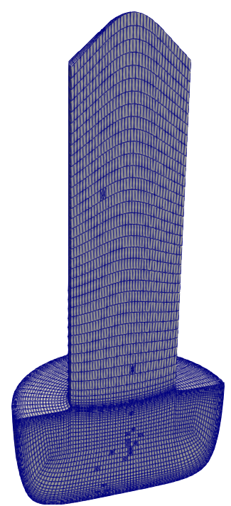
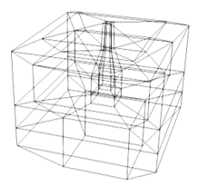
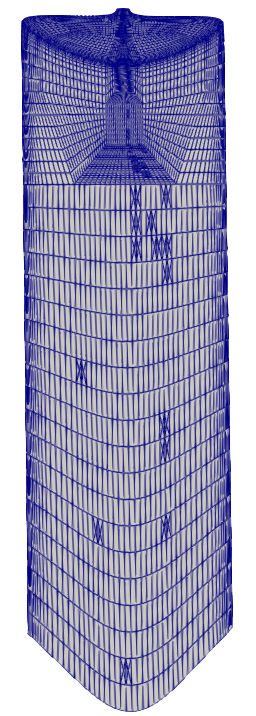
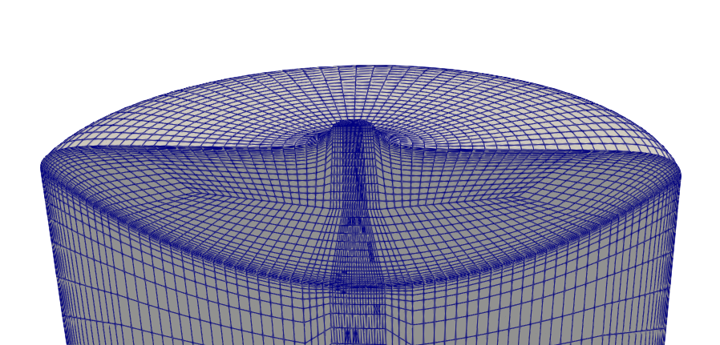

# Examples for nemoblock

Collection of examples for nemoblock

## blocks_01

This is the same example as in the main readme. The resulting mesh looks like this:

# blocks_02

This is a slightly more complex examples showing how to work with blocks. The resulting mesh looks like this:

# cz_grid

This is a complex mesh used for Czochralski growth simulation consisting out of 27 blocks:

The geometry parameters are defined in *cz_points.py*, the mesh is generated with *cz_grid.py*. The mesh looks like this:

# fz_grid

This is a complex mesh used for Floating Zone growth simulation consisting out of 51 blocks:

The geometry parameters are defined in *fz_points.py*, the mesh is generated with *fz_grid.py*. The mesh looks like this:

