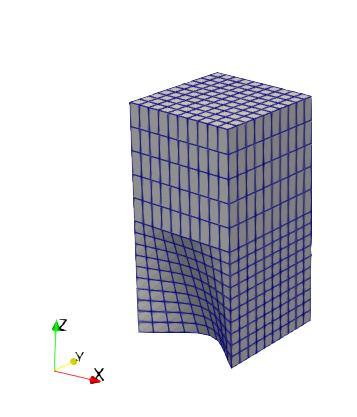

# Examples for nemoblock

Collection of examples for nemoblock

## blocks_01

This is the same example as in the main readme. The resulting mesh looks like this:

## blocks_02

This is a slightly more complex examples showing how to work with blocks. The resulting mesh looks like this:

## ds_grid

This is a more advanced mesh used for Directional Solidification growth simulation consisting out of 8 blocks:

The geometry parameters are defined in *ds_points.py*, the mesh is generated with *ds_grid.py*. The mesh looks like this (vertical cut):

## cz_grid

This is a complex mesh used for Czochralski growth simulation consisting out of 27 blocks:

The geometry parameters are defined in *cz_points.py*, the mesh is generated with *cz_grid.py*. The mesh looks like this (vertical cut):

## cz_2d

This is a simple 2D mesh for Czochralski growth consisting of 7 blocks.

